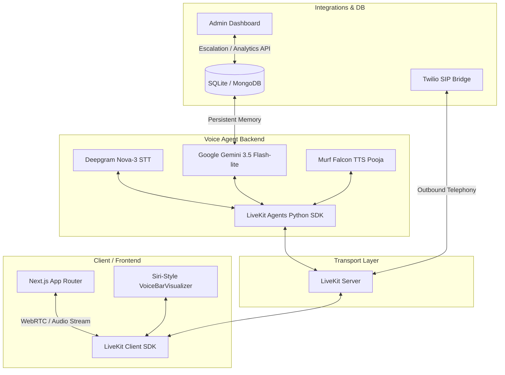

# RupeeGPT (BharatPay) — Next-Gen Voice AI Financial Assistant

**RupeeGPT (formerly BharatPay Voice Assistant)** is a production-ready, low-latency Voice AI agent designed specifically for financial services in India. Built as the culmination of the **10 Days of Voice Agents** challenge, this project delivers a highly contextual, multilingual (English/Hindi/Hinglish) assistant capable of executing complex financial tasks, managing outbound campaigns, and transitioning seamlessly between autonomous AI and human agents.

Powered by **Deepgram STT (Nova-3)**, **Google Gemini 3.5 Flash-lite**, and the ultra-low latency **Murf Falcon TTS (Pooja/Anisha voice)** over **LiveKit WebRTC**, RupeeGPT delivers an interactive voice experience with sub-second response times.

---

## 🚀 Key Features

### 1. Context-Aware Persistent Memory
* **Cross-Session Continuity**: Leverages a persistent storage layer (SQLite/MongoDB) to recognize returning users by their phone number or account ID.
* **Privacy-Compliant Personalization**: Remembers past user preferences, language settings, and unresolved queries, requesting explicit user consent before persisting any sensitive info.

### 2. Live Financial & Domain-Specific Tools
* **`get_usd_inr_rate`**: Real-time USD/INR exchange rate queries.
* **`get_lending_rates`**: Live RBI (Reserve Bank of India) lending and interest rates.
* **`check_scheme_eligibility`**: Evaluates user eligibility for Indian government social welfare schemes (e.g., *PM Suraksha Bima Yojana*, *PM Jan Dhan Yojana*) based on demographic inputs.

### 3. Multi-Agent Specialist Handoff
* **Dynamic Transition**: Seamlessly transfers users mid-conversation to a focused **Government Scheme Specialist** agent when complex welfare questions arise.
* **Context Preservation**: The specialist agent receives the complete conversational context (`chat_ctx`), ensuring the user never has to repeat themselves.

### 4. Proactive Outbound Telephony (Twilio SIP Bridge)
* **Automated Campaigns**: Dispatches proactive voice calls (e.g., scheme enrollment deadline alerts).
* **Outbound Protocol Compliance**: Respects user privacy by stating the caller, company, purpose, and a clear opt-out path within the first two sentences.
* **SIP Integration**: Seamlessly bridges LiveKit WebRTC rooms with traditional phone networks using Twilio TwiML or Linphone.

### 5. Human-in-the-Loop Escalation
* **Safety & Fraud Triggers**: Automatically triggers escalation to human support for high-risk scenarios (such as reporting unauthorized transactions or requesting decision overrides).
* **Real-time Admin Console**: Feeds escalation requests instantly to an interactive Next.js dashboard where admin agents can review and resolve issues.

### 6. Call Analytics & Performance Dashboard
* **Metrics Persistence**: Real-time logging of call statistics (durations, user sentiment, success/failure status, and completion codes) to a central store.
* **Performance Visualizations**: A comprehensive admin dashboard displaying real-time metrics, helping operators monitor agent health and user satisfaction.

---

## 🛠️ Architecture & Tech Stack



### Technology Stack
* **Frontend**: Next.js 14, React, Tailwind CSS, TypeScript, LiveKit Agents UI.
* **Backend**: Python 3.10+, LiveKit Agents SDK (`livekit-agents`), `uv` package manager.
* **LLM Engine**: Google GenAI (`gemini-3.5-flash-lite`).
* **Text-to-Speech**: Murf Falcon TTS (via `livekit-murf` streaming API, **Anisha/Pooja** voices).
* **Speech-to-Text**: Deepgram STT (`nova-3` model).
* **Voice Activity Detection**: Silero VAD.

---

## 📂 Repository Structure

```text
murf-livekit-starter/
├── backend/                       # Python Voice Agent
│   ├── src/
│   │   ├── agent.py               # Main agent entrypoint, tools & pipeline
│   │   ├── memory.py              # Persistent SQLite/MongoDB user memory
│   │   └── outbound_caller.py     # Outbound dialing CLI via Twilio SIP
│   ├── tests/                     # LLM-as-a-judge eval and agent tests
│   ├── pyproject.toml             # Python dependencies managed by uv
│   └── railway.toml               # Backend deployment configuration
├── frontend/                      # Next.js 14 Dashboard & Web UI
│   ├── app/
│   │   ├── dashboard/             # Real-time Call Analytics & Escalation UI
│   │   ├── api/                   # Token issuance and session persistence
│   │   └── page.tsx               # Main voice call portal
│   ├── components/                # Custom React components & voice visualizers
│   └── app-config.ts              # App branding, voice, and theme settings
├── start_app.sh                   # Dev environment bootstrap script
└── README.md                      # Setup and deployment documentation
```

---

## 🎯 Verification & Performance
* **Latency**: Achieving ~130ms Time-to-First-Audio (TTFA) with Murf Falcon's streaming TTS.
* **Testing**: Includes a comprehensive test suite in `backend/tests` using LLM-as-a-judge assertions to validate tools, memory retention, and handoff flows under realistic scenarios.
